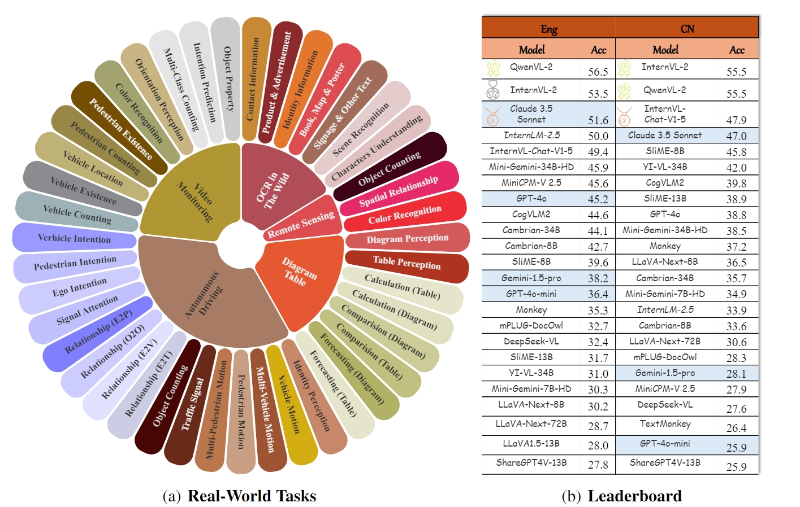
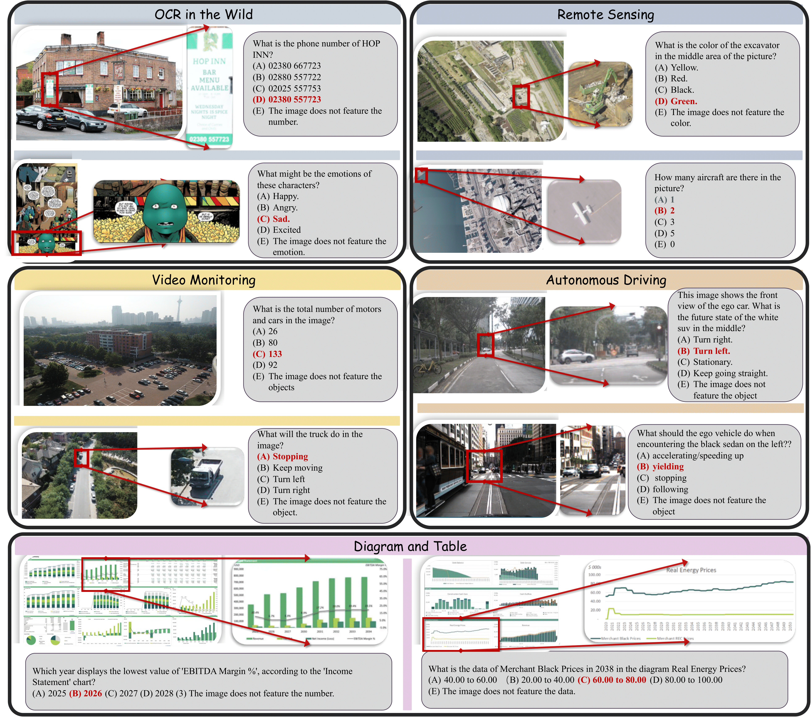
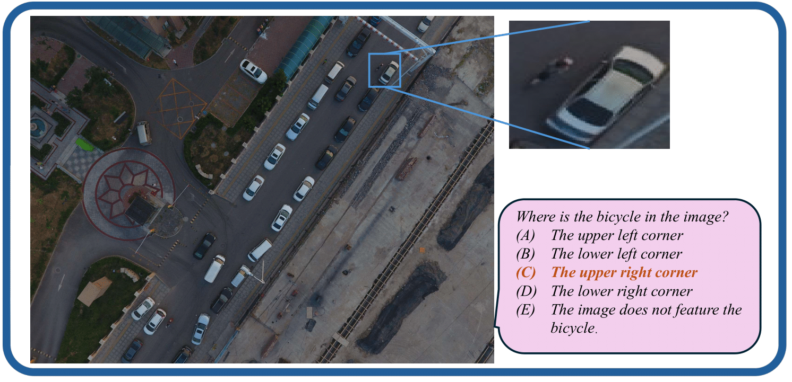
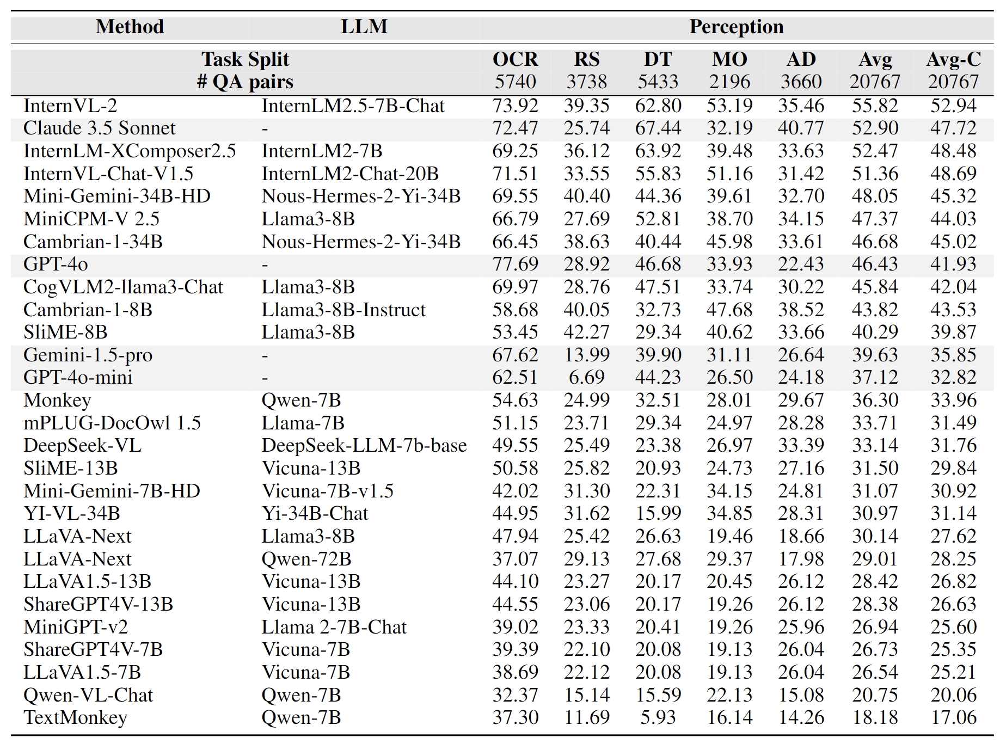
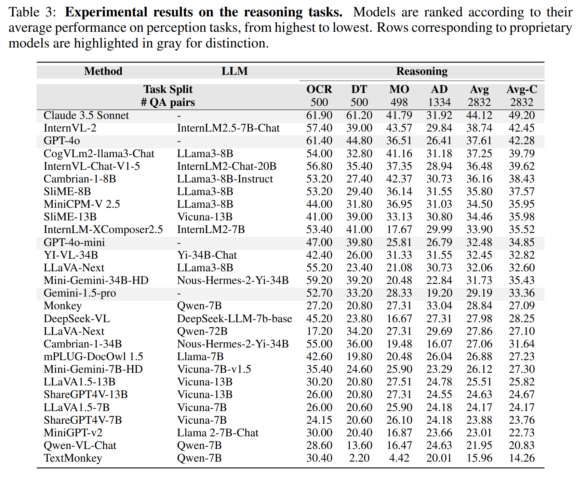
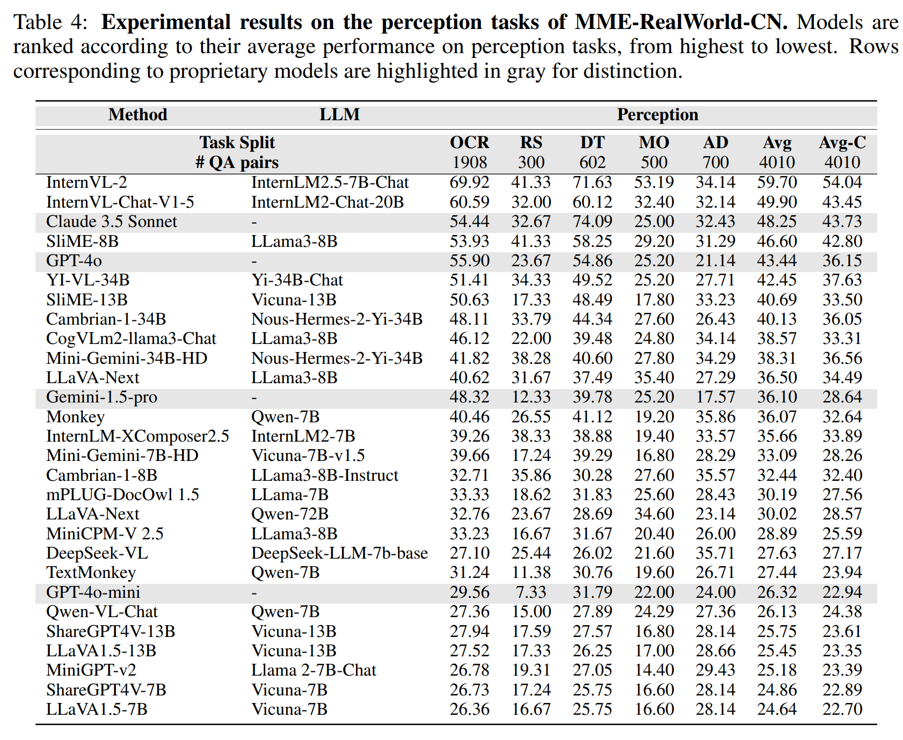
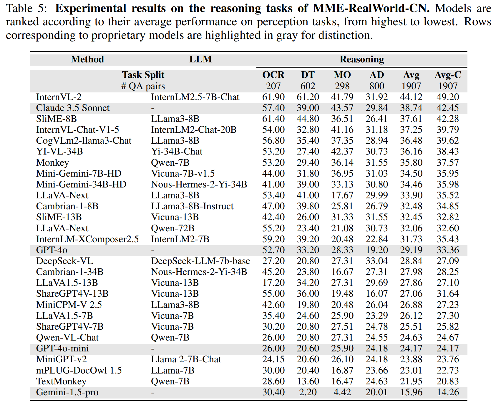

# ✨✨  MME-RealWorld: Could Your Multimodal LLM Challenge High-Resolution Real-World Scenarios that are Difficult for Humans?

 
 
  
 
 


<p align="center">
    
</p>

<font size=7><div align='center' > [[🍎 Project Page](https://mme-realworld.github.io/)] [[📖 arXiv Paper](https://arxiv.org/abs/2408.13257)] [[🤗 Dataset](https://huggingface.co/datasets/yifanzhang114/MME-RealWorld)] [[🤗 Dataset-mini](https://huggingface.co/datasets/yifanzhang114/MME-RealWorld-Lite)][[🏆 Leaderboard](https://MME-RealWorld.github.io/home_page.html#leaderboard)]  </div></font>


---

## 🔥 News
* **`2024.11.14`** 🌟 MME-RealWorld now has a [lite version](https://huggingface.co/datasets/yifanzhang114/MME-RealWorld-Lite) (50 samples per task, or all if fewer than 50) for inference acceleration, which is also supported by VLMEvalKit and Lmms-eval.
* **`2024.09.29`** 🌟 [LLaVA-OneVision](https://arxiv.org/pdf/2408.03326) currently ranks first on our leaderboard, its overall accuracy remains below 60% (57.4%), see our [leaderboard](https://mme-realworld.github.io/home_page.html#leaderboard) for the detail.
* **`2024.09.22`** 🌟 MME-RealWorld is now supported by [lmms-eval](https://github.com/EvolvingLMMs-Lab/lmms-eval) and [VLMEvalKit](https://github.com/open-compass/VLMEvalKit)! Feel free to use it without hesitation!
* **`2024.09.13`** 🌟 We provide a evaluation script based on LLaVA 1.5, please find it in `evaluation/model_vqa_mme_real_world.py`.
* **`2024.08.20`** 🌟 We are very proud to launch MME-RealWorld, which contains 13K high-quality images, annotated by 32 volunteers, resulting in 29K question-answer pairs that cover 43 subtasks across 5 real-world scenarios. As far as we know, **MME-RealWorld is the largest manually annotated benchmark to date, featuring the highest resolution and a targeted focus on real-world applications**.


## 👀 Contents

- [MME-RealWorld Overview](#mme-realworld-overview)
- [Dataset Examples](#dataset-examples)
- [Dataset License](#dataset-license)
- [Evaluation Pipeline](#evaluation-pipeline)
- [Experimental Results](#experimental-results)
- [Citation](#citation)
- [Related Works](#related-works)


## MME-RealWorld Overview

Existing Multimodal Large Language Model benchmarks present several common barriers that make it difficult to measure the significant challenges that models face in the real world, including: 
1) small data scale leads to a large performance variance; 
2) reliance on model-based annotations results in restricted data quality; 
3) insufficient task difficulty, especially caused by the limited image resolution.

We present MME-RealWorld, a benchmark meticulously designed to address real-world applications with practical relevance. Featuring 13,366 high-resolution images averaging 2,000 × 1,500 pixels, MME-RealWorld poses substantial recognition challenges. Our dataset encompasses 29,429 annotations across 43 tasks, all expertly curated by a team of 25 crowdsource workers and 7 MLLM experts. The main advantages of MME-RealWorld compared to existing MLLM benchmarks as follows:

1. **Data Scale**: with the efforts of a total of 32 volunteers, we have manually annotated 29,429 QA pairs focused on real-world scenarios, making this the largest fully human-annotated benchmark known to date.

2. **Data Quality**: 1) Resolution: Many image details, such as a scoreboard in a sports event, carry critical information. These details can only be properly interpreted with high- resolution images, which are essential for providing meaningful assistance to humans. To the best of our knowledge, MME-RealWorld features the highest average image resolution among existing competitors. 2) Annotation: All annotations are manually completed, with a professional team cross-checking the results to ensure data quality.

3. **Task Difficulty and Real-World Utility**: We can see that even the most advanced models have not surpassed 60% accuracy. Additionally, many real-world tasks are significantly more difficult than those in traditional benchmarks. For example, in video monitoring, a model needs to count the presence of 133 vehicles, or in remote sensing, it must identify and count small objects on a map with an average resolution exceeding 5000×5000.

4. **MME-RealWord-CN**: Existing Chinese benchmark is usually translated from its English version. This has two limitations: 1) Question-image mismatch. The image may relate to an English scenario, which is not intuitively connected to a Chinese question. 2) Translation mismatch. The machine translation is not always precise and perfect enough. We collect additional images that focus on Chinese scenarios, asking Chinese volunteers for annotation. This results in 5,917 QA pairs.


<p align="center">
    
</p>

## Dataset Examples

<p align="center">
    
</p>

<div align='center' >
<details>
<summary> Click to expand more examples</summary>
<p align="center">
    
    
</details>
</div>


## Dataset License

**License**:
```
MME-RealWorld is only used for academic research. Commercial use in any form is prohibited.
The copyright of all images belongs to the image owners.
If there is any infringement in MME-RealWorld, please email yifanzhang.cs@gmail.com and we will remove it immediately.
Without prior approval, you cannot distribute, publish, copy, disseminate, or modify MME-RealWorld in whole or in part. 
You must strictly comply with the above restrictions.
```

Please send an email to **yifanzhang.cs@gmail.com**. 🌟


## Evaluation Pipeline

📍 **Prompt**:

The common prompt used in our evaluation follows this format:

```
[Image] [Question] The choices are listed below:
(A) [Choice A]
(B) [Choice B]
(C) [Choice C]
(D) [Choice D]
(E) [Choice E]
Select the best answer to the above multiple-choice question based on the image. Respond with only the letter (A, B, C, D, or E) of the correct option. 
The best answer is:
```


📍 **Evaluation**: 


We offer two methods for downloading our images and QA pairs:

1. **Base64 Encoded Images**: We have encoded all images in Base64 format and uploaded them to our [Hugging Face repository](https://huggingface.co/datasets/yifanzhang114/MME-RealWorld-Base64), which includes two folders: `MME-RealWorld` and `MME-RealWorld-CN`. The JSON files within these folders can be read directly, with the images in Base64 format. By using the `evaluation/download_and_prepare_prompt.py` script and creating a class `MMERealWorld`, you can automatically download and convert the data into a CSV file that can be used directly. You can use the `decode_base64_to_image_file` function to convert the Base64 formatted images back into PIL format.

2. **Direct Image Download**: You can download the images and data directly from our [Baidu Netdisk](https://pan.baidu.com/s/1KO1t14TLN1RcwN5whbVY1g?pwd=p82w) or [Hugging Face repository](https://huggingface.co/datasets/yifanzhang114/MME-RealWorld). For Hugging Face, follow the instructions to decompress the split compressed images. The file `MME_RealWorld.json` contains the English version of the questions, while `MME_RealWorld_CN.json` contains the Chinese version. Make sure to place all the decompressed images in the same folder to ensure the paths are read correctly.


To extract the answer and calculate the scores, we add the model response to a JSON file. Here we provide an example template [output_test_template.json](./evaluation/output_test_template.json). Once you have prepared the model responses in this format, please refer to the evaluation script [eval_your_results.py](./evaluation/eval_your_results.py), and you will get the accuracy scores across categories, subtasks, and task types. 
The evaluation does not introduce any third-party models, such as ChatGPT.

```bash
python eval_your_results.py \
    --results_file $YOUR_RESULTS_FILE \
```
Please ensure that the `results_file` follows the specified JSON format stated above.

📍 **Leaderboard**: 

If you want to add your model to our [leaderboard](https://MME-RealWorld.github.io/home_page.html#leaderboard), please send model responses to **bradyfu24@gmail.com**, as the format of [output_test_template.json](./evaluation/output_test_template.json).


## Experimental Results
Models are ranked according to their average performance. Rows corresponding to proprietary models are highlighted in gray for distinction. “OCR”, “RS”, “DT”, “MO”, and “AD” each indicate a specific task domain: Optical Character Recognition in the Wild, Remote Sensing, Diagram and Table, Monitoring, and  Autonomous Driving, respectively. “Avg” and “Avg-C” indicate the weighted average accuracy
and the unweighted average accuracy across
subtasks in each domain.
- **Evaluation results of different MLLMs on the perception tasks.**

<p align="center">
    
</p>


- **Evaluation results of different MLLMs on the reasoning tasks.**

<p align="center">
    
</p>

- **Evaluation results of different MLLMs on the perception tasks of MME-RealWorld-CN.**

<p align="center">
    
</p>

- **Evaluation results of different MLLMs on the reasoning tasks of MME-RealWorld-CN.**

<p align="center">
    
</p>


## Citation

If you find our work helpful for your research, please consider citing our work.   

```bibtex
@article{zhang2024mme,
  title={MME-RealWorld: Could Your Multimodal LLM Challenge High-Resolution Real-World Scenarios that are Difficult for Humans?},
  author={Zhang, Yi-Fan and Zhang, Huanyu and Tian, Haochen and Fu, Chaoyou and Zhang, Shuangqing and Wu, Junfei and Li, Feng and Wang, Kun and Wen, Qingsong and Zhang, Zhang and others},
  journal={arXiv preprint arXiv:2408.13257},
  year={2024}
}
```

## Related Works

Explore our related researches:
- **[SliME]** [Beyond LLaVA-HD: Diving into High-Resolution Large Multimodal Models](https://github.com/yfzhang114/SliME)
- **[VITA]** [VITA: Towards Open-Source Interactive Omni Multimodal LLM](https://github.com/VITA-MLLM/VITA)
- **[MME]** [MME: A Comprehensive Evaluation Benchmark for Multimodal Large Language Models](https://github.com/BradyFU/Awesome-Multimodal-Large-Language-Models/tree/Evaluation)

